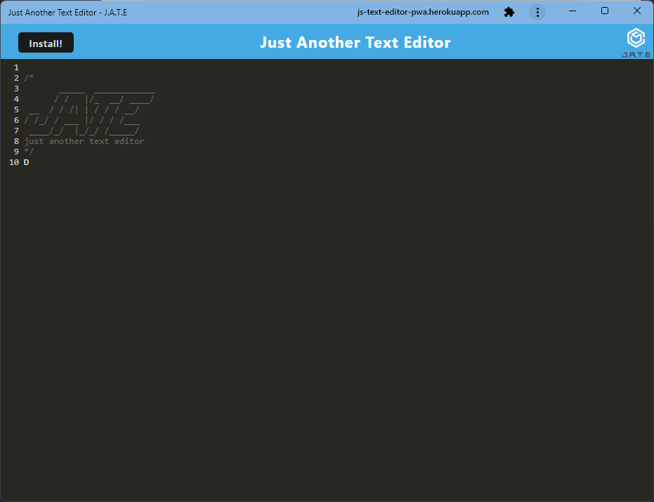

# pwa-text-editor

  
 


## Description 

This project allows developers to draft code fragments and notes offline using a progressive web application. IndexedDB is utilized to save the user's notes for when they're back online. This project also uses Webpack and service workers to cache the site data for offline use.

## User Story

```md
AS A developer
I WANT to create notes or code snippets with or without an internet connection
SO THAT I can reliably retrieve them for later use
```

## Table of Contents 
* [Screenshots](#screenshots)
* [Deployed App](#deployed-app)
* [Usage](#usage)
* [Features](#features)
* [License](#license)
* [Questions](#questions)

## Screenshots
<br>



<br>

## Deployed App

https://js-text-editor-pwa.herokuapp.com/

## Usage
- Install the PWA using the 'Install' button in the application or the built-in browser PWA installation button, or just use the app in the browser of your choice.

## Features

- `IndexedDB` - JavaScript application programming interface (API) provided by web browsers for managing a NoSQL database of JSON objects.
- `Webpack` - Module bundler to take modules with dependencies and generate static assets representing those modules.
- `express.js` - Back end web application framework for building RESTful APIs with Node.js.
- `Node.js` - Used for package managment and to execute the JavaScript code that builds the server-side command line scripting  tool.
- `JavaScript` - Used to base functionality within the application.
- `Git` - Version control system used to track source code changes.


## License

MIT License

---

## Questions?

Reach out with any questions!

GitHub: [vlad-kronk](https://github.com/vlad-kronk)

[](https://www.linkedin.com/in/jmeyers6/)